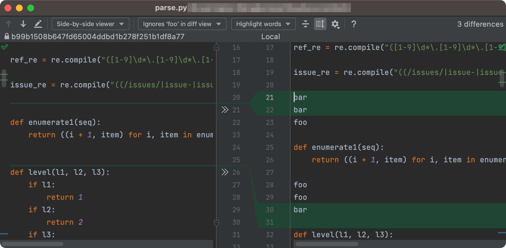

# IntelliJ plugin: ignore foo in diff

<!-- Plugin description -->
Are you tired of seeing "foo" every time you view a diff of a file? This plugin solves that. It adds an ignore option to the diff viewer, to ignore all occurrences of "foo" and any whitespace that follows.
<!-- Plugin description end -->

